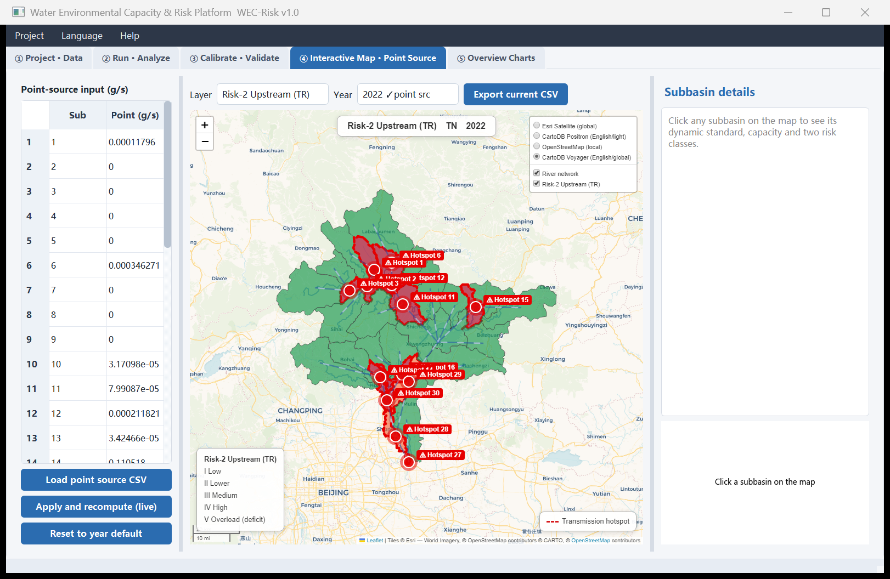

# WEC-Risk Platform · 水环境容量与风险评估集成平台


> An integrated desktop tool that turns a built **SWAT2012** project into water environmental
> capacity & two-class pollution-risk maps — **bilingual (中文 / English)**, interactive, and
> portable to any watershed. Released as the reference implementation of the associated paper.
>
> 一款把已建 **SWAT2012** 工程一键转化为水环境容量与两类污染风险地图的桌面程序——中英双语、
> 交互式、可迁移到任意流域；作为相关论文的具体实现一并发布。

**Pipeline / 集成流程:**
SWAT outputs → key-factor screening → dynamic adaptive standard (CRS-ACM) → base & actual water
environmental capacity → two-class risk (local **LP** / upstream-transport **TR**) → high-risk areas
& transmission hotspots → **interactive map**.

---

## 📑 Contents
[Features](#-features--功能) · [Screenshots](#-screenshots--界面预览) · [Quick start](#-quick-start--快速开始) ·
[Structure](#-repository-structure--目录结构) · [Example data](#️-example-data--示例数据) ·
[SWAT prerequisite](#-swat-prerequisite--swat-前置) · [Methodology](#-methodology--方法学与公式) ·
[Citation](#-citation--引用) · [License & Patent](#-license--patent--许可证与专利) · [Manuals](#-manuals--详细手册)

---

## ✨ Features / 功能

- **Two mutually-exclusive risk indices** — Risk-1 (local) `LP = corrected NPS / W_actual`;
  Risk-2 (upstream transport) `TR = upstream inflow / W_actual`. 两类互不重叠的风险指数。
- **Interactive Leaflet map** — click a subbasin → dynamic standard, base/actual capacity, both
  risk classes; switchable thematic layers; **prominent transmission hotspots**; topology flow arrows.
- **Bilingual UI + global base maps** — OpenStreetMap (local), CartoDB Voyager/Positron (English),
  Esri Satellite; live language switch (中文 ⇄ English).
- **Per-year analysis** with user-selectable **spin-up years (NYSKIP)**; actual capacity & risk are
  produced **only for years that have point-source data**.
- **Multi-watershed portable** — auto-detect any SWAT2012 project (zero hardcoding);
  **pollutant interfaces for TN / TP / COD**.
- **Hybrid factor calibration** (monitoring ROC·Youden / SWAT quantile / manual) with provenance,
  and AUC validation against an independent biological response.
- **Reproducible** — a headless `--cli --reconcile` mode reproduces the published numbers to ~1e-12.

## 🖼 Screenshots / 界面预览



> **WEC-Risk Platform v1.0 — interactive map tab.** Click any subbasin to see its dynamic standard,
> base/actual capacity and both risk classes; the Risk-2 (upstream-transport, **TR**) layer highlights
> transmission **hotspots** (red markers). 交互地图页：点击子流域查看其动态标准、基础/实际容量与两类
> 风险；第二类（上游传输 **TR**）风险图层突出显示传输**热点**（红色标记）。

## 🚀 Quick start / 快速开始

**From source / 源码运行**
```bash
pip install -r requirements.txt
python main.py                       # GUI — menu: Project ▸ "Load Miyun example"
# headless reconcile against the published numbers:
python main.py --cli --project examples/miyun_project.json --year 2022 --reconcile
```

**Windows .exe / 打包可执行文件**
```bat
build_exe.bat                        REM -> dist\WEC_Platform\WEC_Platform.exe (self-contained, with example data)
```

> ⚠️ **Do not commit `build/` or `dist/`** (≈0.5 GB, already in `.gitignore`). Distribute the `.exe`
> via a GitHub *Release* asset or cloud drive — the repository ships **source + a 7 MB example only**.

## 📦 Repository structure / 目录结构

```
.
├── main.py                       # entry point (GUI / --cli)
├── requirements.txt
├── build_exe.bat · wec_platform.spec
├── LICENSE · NOTICE · CITATION.cff · .gitignore
├── README.md · README_中文.md · README_English.md
├── wec_platform/                 # source package
│   ├── config.py project.py swat_io.py swat_runner.py
│   ├── calibration.py pipeline.py geo.py mapview.py i18n.py
│   └── ui/  (main_window, panels, charts, state, bridge, style)
├── examples/
│   ├── miyun_project.json        # portable example project (relative paths)
│   └── monitoring_template.csv   # calibration/validation data format (Month, TN, Algae)
├── docs/                         # put screenshots / extra docs here
└── data/Miyun/                   # bundled example (Miyun Reservoir basin, analysis-ready subset)
    ├── Watershed/Shapes/{subs1,riv1}.*
    ├── Scenarios/Miyun_Calib_01/TxtInOut/{file.cio,fig.fig,output.rch,output.sub}
    ├── Scenarios/Miyun_Calib_01/subbasin_water_quality_standards.csv  (+ extract_*.csv)
    └── PL_Point_TN_{2020,2021,2022}.csv
```

## 🗺️ Example data / 示例数据

`data/Miyun/` holds the **analysis-ready outputs** of a calibrated SWAT2012 model of the Miyun
Reservoir basin (Beijing, 32 subbasins) — sufficient to run the full screening → standard →
capacity → risk → visualization workflow and to reproduce the paper's numbers. The **full ~3 GB
SWAT model (weather, HRU inputs) is intentionally not included**; to re-run SWAT itself, point the
tool at your own complete SWAT project.

示例 `data/Miyun/` 仅含已标定 SWAT 模型的**分析所需输出**（约 7 MB），足以跑通全流程并复现论文
数值；完整约 3 GB 的 SWAT 模型（天气/HRU 输入）未随仓库分发。

## 🔬 SWAT prerequisite / SWAT 前置

Watershed delineation, HRU definition and weather writing are performed in **QSWAT / ArcSWAT**;
this tool reads the **model outputs** (`output.rch`, `output.sub`, `file.cio`, `fig.fig`) plus the
subbasin/river shapefiles. Minimum file set and data formats are in the manuals.

流域划分、HRU 定义与天气写入在 **QSWAT** 中完成；本工具读取其输出与矢量。最小文件集见手册。

## 📐 Methodology / 方法学与公式

| Step | Formula (faithful to the validated scripts) |
|---|---|
| Dynamic adaptive standard (CRS-ACM) | `C_dynamic = C_strict + (C_loose − C_strict)·AdjIndex`, `C_loose = min(C_strict+δ, cap)` |
| Base capacity | `Wi = a·[86.4·Q·(C_it − C_up) + 1e-3·K·V·C_it]` (negative capacity retained; mass-weighted conc.) |
| NPS transport rate | `R = (IN_river + NPS + point − OUT)/(IN_river + NPS + point)` (per-year point source) |
| Actual capacity | `W_actual = Wi − that-year point source` |
| Risk-1 (local) | `LP = corrected NPS / W_actual` |
| Risk-2 (upstream transport) | `TR = upstream inflow Influx / W_actual` |

- **Key-factor screening** uses SWAT-simulated data (MI + Spearman, with p-values & bootstrap) — a
  driver analysis on a calibrated model. **Threshold calibration** prefers independent biological
  monitoring (ROC / Youden) to keep the validation non-circular; a SWAT-quantile fallback is marked
  *provisional*. See the manuals for the full rationale and caveats.

## 📚 Citation / 引用

If you use this software, please cite **both** the software and the paper. Citation metadata is in
[`CITATION.cff`](CITATION.cff) (GitHub shows a *"Cite this repository"* button). BibTeX template:

```bibtex
@software{wecrisk_platform_2026,
  author  = {Sun, Haiming},
  title   = {WEC-Risk Platform: SWAT-based water environmental capacity and two-class risk assessment},
  year    = {2026},
  version = {1.0},
  url     = {https://github.com/Hai-mian-33/WEC-Risk-Platform},
  license = {MIT}
}
% Peer-reviewed paper in preparation — switch to @article (add journal/volume/doi) on acceptance:
@unpublished{wecrisk_paper_2026,
  author  = {Sun, Haiming},
  title   = {<Paper title>},
  year    = {2026},
  note    = {Manuscript in preparation}
}
```

## ⚖️ License & Patent / 许可证与专利

- **Software code: [MIT License](LICENSE).** Free to use, modify and redistribute with attribution.
- **Patent:** the underlying *method* is covered by a separate patent / application held by the
  author (see [`NOTICE`](NOTICE)). The MIT license covers the **code only** and grants **no patent
  license**. 软件代码采用 MIT；本方法另有专利，MIT 不授予专利许可，详见 `NOTICE`。
- **Binary redistribution note:** the bundled `.exe` includes **PyQt5 (GPL)**. Distributing the
  source under MIT is unaffected, but redistributing the built binary must comply with PyQt5's GPL
  terms (or use a commercial Qt license). 见 `NOTICE`。

> ℹ️ Author, Chinese Patent Application No. (202610879952.8) and repository URL are filled in. The **paper citation**
> (title / journal / DOI) will be added to `CITATION.cff` and the BibTeX above once the manuscript is accepted.

## 📖 Manuals / 详细手册

- **中文使用说明：[README_中文.md](README_中文.md)**
- **English manual: [README_English.md](README_English.md)**

## 🙏 Acknowledgements / 致谢

Built on SWAT (USDA-ARS / Texas A&M), QSWAT, and the open-source Python geospatial stack
(geopandas, shapely, pyproj, pyogrio), PyQt5, Leaflet/folium, and base maps © OpenStreetMap
contributors, © CARTO, and Esri.
